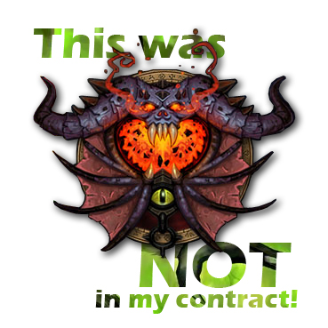

# Warlock
Warlock é um compilador em JavaScript para a linguagem de programação [IMP](https://github.com/ChristianoBraga/BPLC/tree/master/examples/imp) :smiling_imp:

## Instruções:
Executar arquivo "index.html" localizado na pasta "Warlock - Web Edition"

Nota: o passo a passo também é impresso no console do navegador, para melhor visualização.
No chrome, o atalho é F12.

## Linguagem:
~~Curry~~
~~Groovy~~
Javascript 

## Grupo: 

* Caio Saracuza Luz

* Eduardo Motta Ramos

### In Memoriam

:ghost: ~~Arthur Vieira~~

:ghost: ~~Beatriz Campos~~

### Membro Honorário:

 * Karina Pedroza

Observação: Este é um projeto construído com finalidade exclusivamente educacional em uma matéria da Universidade Federal Fluminense. 
